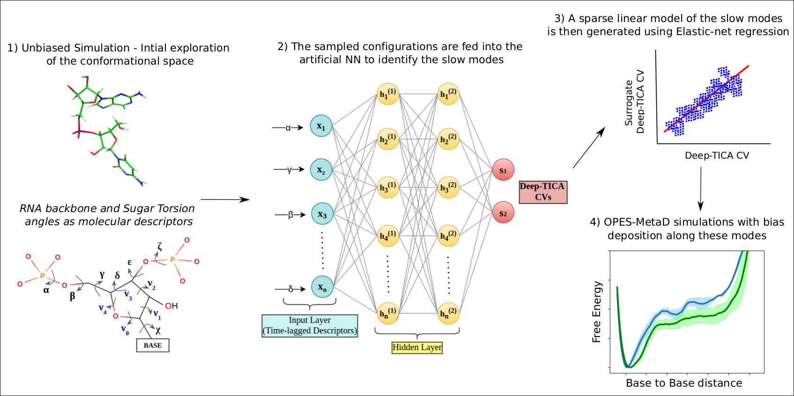

# Enhanced sampling simulation using Machine-Learning Collective Variables revealed the free-energy landscapes of fluorescent base-analogue-substituted RNA oligonucleotides

Code to reproduce the paper [Conformational Landscape of 2-Aminopurine-Substituted RNA Oligonucleotides from Machine-Learning-Driven Enhanced Sampling]

The systems studied are: 5' A-A 3',5' A-C 3',5' C-A 3',5' C-A-C 3', with 2-Amino Purine Fluorescent Base Analogue (FBA) and without 2-Amino Purine FBA. 

